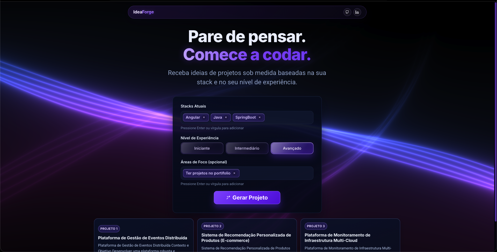

# Idea Forge Front

Frontend do **Idea Forge**, uma aplicação Angular que gera ideias de projeto com base em:

- stacks atuais do usuário;
- nível de experiência;
- áreas de foco opcionais.

A interface renderiza cards de ideias e um modal com detalhes quando a API retorna conteúdo em Markdown.

## Screenshot



## Stack

- Angular 21 (standalone components);
- TypeScript;
- SCSS;
- RxJS;
- Three.js (fundo animado com shader).

## Funcionalidades

- Entrada de tags para `Stacks Atuais` e `Áreas de Foco`;
- Adição de tags com `Enter` ou `,`;
- Remoção de tag individual e remoção da última tag com `Backspace` (input vazio);
- Seleção de nível de experiência (`Iniciante`, `Intermediário`, `Avançado`);
- Geração de ideias via API (`POST /api/v1/ideas/generate`);
- Parsing de `markdownContent` para cards e modal de detalhes;
- Fallback para texto/JSON quando a resposta não vem em markdown estruturado;
- Tratamento de erros de requisição com mensagem amigável.

## Pré-requisitos

- Node.js;
- npm;
- Backend do Idea Forge rodando localmente (padrão: `http://localhost:8080`).

## Instalação

```bash
npm install
```

## Executando em desenvolvimento

```bash
npm start
```

A aplicação sobe em `http://localhost:4200/`.

## Scripts disponíveis

- `npm start`: inicia servidor de desenvolvimento;
- `npm run build`: gera build de produção em `dist/idea-forge-front`;
- `npm run watch`: build em modo watch (configuração de desenvolvimento);
- `npm test`: executa testes unitários com Karma.

## Integração com API

Endpoint atual no frontend:

- `src/app/services/idea.service.ts`
- URL padrão: `http://localhost:8080/api/v1/ideas/generate`

Payload enviado:

```json
{
  "stacks": ["React", "Node.js"],
  "experienceLevel": "Intermediate",
  "focusAreas": ["Arquitetura", "Testes"]
}
```

Mapeamento de nível de experiência:

- `iniciante` -> `Beginner`
- `intermediario` -> `Intermediate`
- `avancado` -> `Advanced`

## Formatos de resposta aceitos

O frontend suporta múltiplos formatos de resposta:

- Objeto com `markdownContent` (preferencial, com separação por `---` para múltiplas ideias);
- String simples;
- Objeto com campos de texto como `idea`, `projectIdea`, `content`, `description`, `message` ou `result`.

## Estrutura principal

```text
src/
  app/
    components/
      floating-lines/
      header/
    pages/
      home/
    services/
      idea.service.ts
```

## Observações

- A pasta `out-tsc/` é saída intermediária de compilação do Angular/TypeScript;
- Não é pasta de deploy;
- Pode ser recriada automaticamente durante build/teste.
